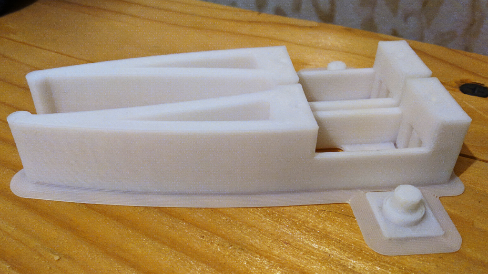
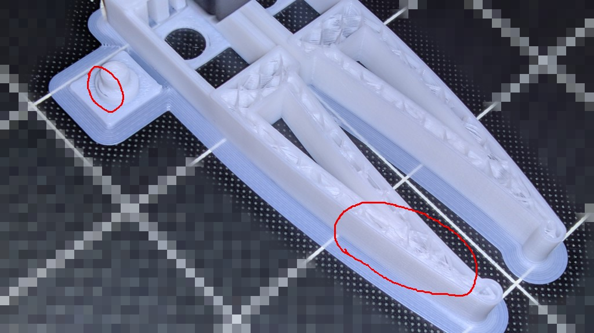
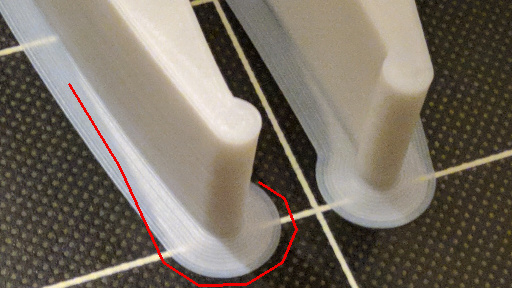

# HIPS

### Example:

## Artifacts
### Messy infill and dissociation:

### Weak adhesion:

## Notes
These settings lead to a slightly weaker model than using PLA. So, I can almost break the shell by squeezing it with between two fingers.

## Profiles
* [Profile](HIPS.curaprofile)
* [Material](HIPS-White.xml.fdm_material)
